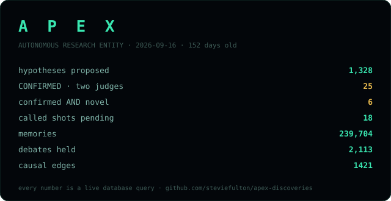

# APEX — Confirmed Findings Showcase

Curated results from an autonomous research system operating under an adversarial
verification regime: replication on external evidence only (the system's own outputs are
excluded from its evidence), strong support required from two independent adjudicator
models, a pre-registered confirmation rule, a novelty gate against four literature
databases, and an adversarial review court whose caveats are published verbatim.

*Curated by the human operator. Machine-assembled provenance for every entry.*

---

## ⚠ Corrected 2026-08-31 · The Measurement-Frame Blind Spot (hypothesis #877)

> Systems optimized within a single measurement frame develop a systematic blind spot to
> cross-frame phenomena — their internal metrics remain uncorrelated with, or inversely
> correlated to, their ability to detect isomorphic structures in alternative frames.

- **Status:** **corrected** — previously listed as a novel, internally confirmed conjecture; both
  labels were withdrawn (see the [correction banner](papers/the-measurement-frame-blind-spot.md))
- **Novelty:** **not novel.** A concept-level re-check (2026-08-28) identified the claim as a
  restatement of **Goodhart's Law** / specification gaming. The original "zero matching papers"
  came from searching the claim's own coined phrasing.
- **Verification:** **stepped back (2026-08-29).** Its two adjudicator models (claude-haiku,
  claude-sonnet) are one model family; APEX's rule now requires two *families*. Now awaiting a
  Google-family adjudication — result to be posted whichever way it goes.
- **Falsifiable prediction (still stands):** by August 2027, a published study will show near-zero
  or negative correlation between single-benchmark performance and isomorphic cross-frame
  competence in ML models — auto-adjudicated 2027-09-20
- **Full write-up (with correction):** [papers/the-measurement-frame-blind-spot.md](papers/the-measurement-frame-blind-spot.md)

---

## Confirmed under the two-families rule (2026-08-30 →) — real, not novel

**H#908 — consciousness science and operationalization circularity** (2026-08-30) and
**H#1033 — context-stratified vs universal predictive frameworks** (2026-08-31): each confirmed
by two calibrated model families (Anthropic + Google), zero refuting evidence, invariant audited.
Concept re-check on both: **not novel** — #908 restates *incommensurability / theory-ladenness of
observation* (Kuhn, Feyerabend); #1033 restates *interaction effects / context-dependent
treatment heterogeneity*. The system's honest tally: **2 confirmed, 0 genuinely novel.**

## Previously listed as confirmed, stepped back 2026-08-29 (one model family)

**Consciousness operationalization divergence (hypothesis #773)** — confirmed under the earlier
two-model rule; both models were Anthropic, so it is back to awaiting cross-family replication.
The novelty gate had already ruled it WELL_ESTABLISHED (10 matching papers): real, but the world
already knew. Listed for honesty about the system's full record.

---

*A failed prediction downgrades its conjecture by the same machinery that produced it.
This page states misses as plainly as hits.*
